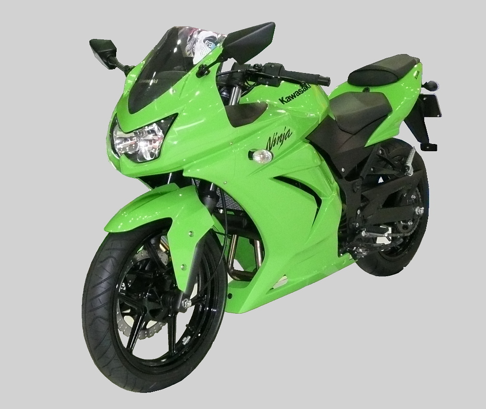
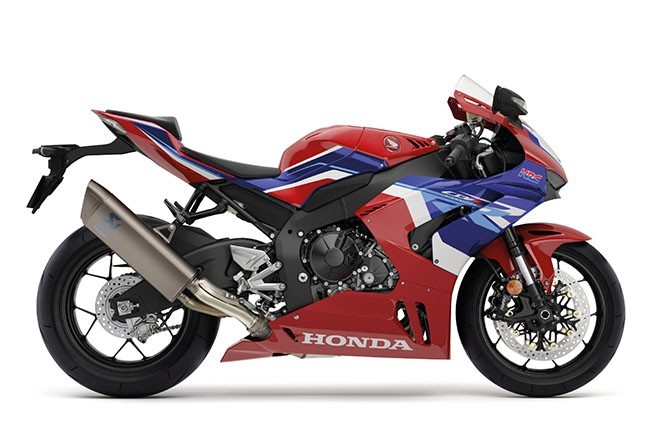

# Motorcycle Information

Here is some information about different motorcycle models:

## BMW M1000RR

Description of Model 1.

## Ducati Panigale V4 R

Description of Model 2.

## Ducati Superleggera V4

Description of Model 3.

## Suzuki Hayabusa

Description of Model 4.

## Kawasaki Ninja 250R

Description of Model 5.

## Honda CBR 1000RR

Description of Model 6.

## Model 7

Description of Model 7.

## Model 8

Description of Model 8.

## Model 9

Description of Model 9.

## Model 10

Description of Model 10.

## Model 11

Description of Model 11.

## Model 12

Description of Model 12.

## Model 13

Description of Model 13.

## Model 14

Description of Model 14.

## Model 15

Description of Model 15.
