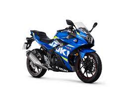
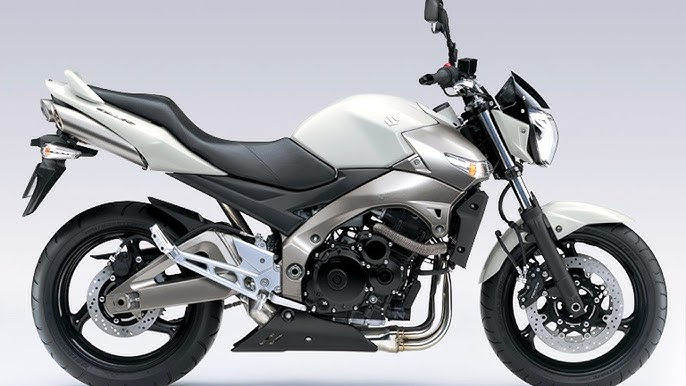
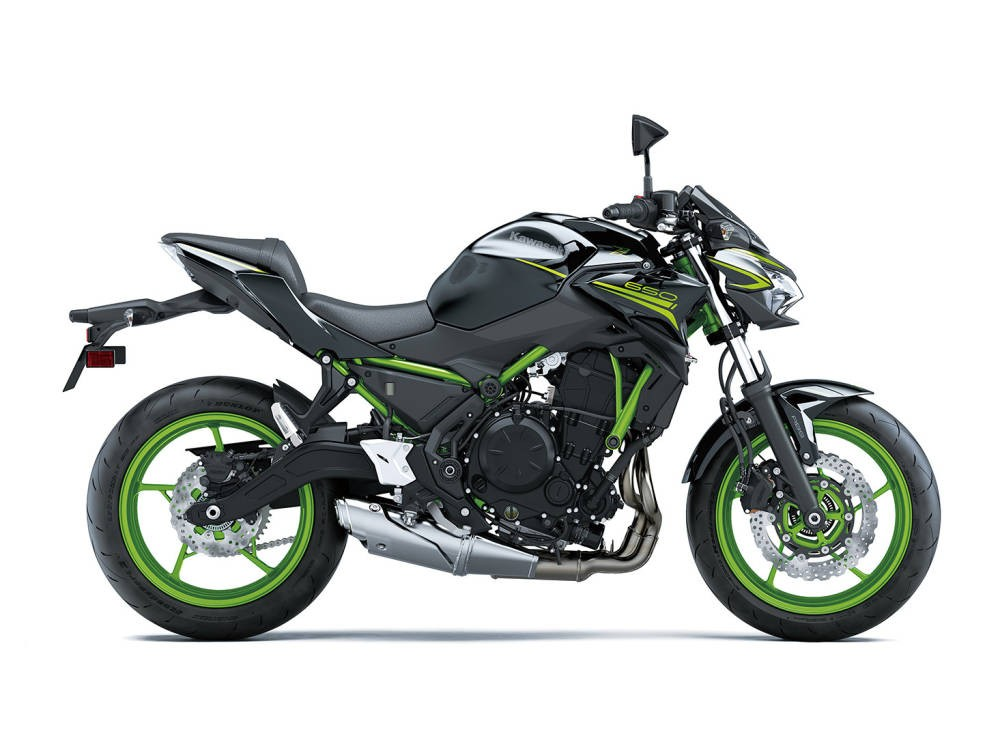

# Motorcycle Information

Here is some information about different motorcycle models:

## BMW M1000RR

Description of Model 1.

## Ducati Panigale V4 R

Description of Model 2.

## Ducati Superleggera V4

Description of Model 3.

## Suzuki Hayabusa

Description of Model 4.

## Kawasaki Ninja 250R

Description of Model 5.

## Honda CBR 1000RR

Description of Model 6.

## Benelli 752S

Description of Model 7.

## Suzuki GSX600

Description of Model 8.

## Honda Hornet 600

.jpg)

Description of Model 9.

## Suzuki GSR600

Description of Model 10.

## BMW R1200GS

Description of Model 11.

## Kawasaki Ninja 650R

Description of Model 12.

## KTM Duke 125

Description of Model 13.

## Kawasaki Ninja H2R

Description of Model 14.

## Ducati Diavel

Description of Model 15.
